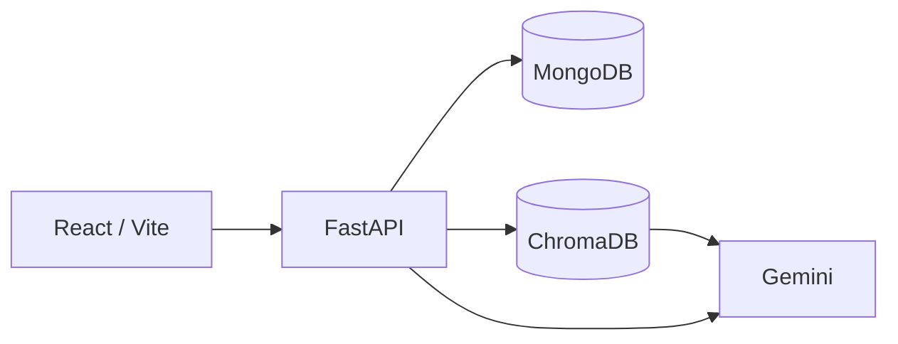
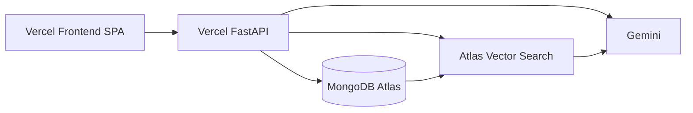

# SupportFlow AI

## AI-Powered Customer Support SaaS Platform

SupportFlow AI is a workspace-scoped customer support platform for support agents. It combines conversations, tickets, customers, a publishable knowledge base, and Gemini-powered assistance grounded in retrieved knowledge (RAG).

Agents work inside an authenticated dashboard. AI answers and suggested replies are generated from published, workspace-scoped knowledge and **must be reviewed before anything is sent**—the system does not autonomously message customers.

---

## Project Overview

**Problem.** Support teams need one place to handle customer threads, track tickets, maintain policies, and draft accurate replies without inventing answers.

**Solution.** SupportFlow AI provides a multi-tenant agent workspace with REST APIs, MongoDB persistence, vector retrieval for knowledge, and human-in-the-loop AI drafting.

**Target users.** Customer support agents, admins, and workspace owners evaluating or operating an internal support console.

**Engineering goal.** Demonstrate a production-oriented full-stack AI SaaS: JWT auth, RBAC, server-side tenancy, FastAPI services, React UI, RAG with environment-specific vector stores, tests, and Vercel deployment.

---

## Key Features

| Category | What is implemented |
|---|---|
| **Authentication** | Email/password register and login, JWT access tokens, logout |
| **Workspace Management** | Personal workspace on register, active workspace selection, account display, light/dark theme |
| **Conversations** | Create threads and messages, statuses (Open / Waiting / Closed / AI Resolved), agent assignment |
| **AI Assistant** | Knowledge-grounded Q&A with source citations via RAG + Gemini |
| **AI Suggested Replies** | Draft replies from the latest customer message; agent reviews before sending |
| **Knowledge Base** | CRUD, Draft/Published, ingestion into the configured vector store, semantic search |
| **RAG** | Chunk → embed → retrieve (Published + `workspace_id`) → grounded generation or safe no-answer |
| **Customers** | Workspace CRM directory with search and related conversations/tickets |
| **Tickets** | Status, priority, customer link, optional conversation link, team-member assignment |
| **Team Management** | OWNER / ADMIN / AGENT directory for assignment and role-aware management (directory-only members do not sign in) |
| **Global Search** | Workspace-scoped search across conversations, tickets, customers, and knowledge (`GET /api/v1/search`) |
| **Analytics** | Conversation counts derived from the real inbox |
| **Security** | bcrypt, JWT, RBAC, CORS allow-list, rate limiting, production config validation |

---

## Product Screenshots

Screenshots of the main agent workspace (dashboard, inbox, AI, knowledge, tickets, customers, analytics, and team) belong under `docs/screenshots/`.

```text
docs/screenshots/dashboard.png
docs/screenshots/conversations.png
docs/screenshots/ai-assistant.png
docs/screenshots/knowledge-base.png
docs/screenshots/tickets.png
docs/screenshots/customers.png
docs/screenshots/analytics.png
docs/screenshots/team.png
```

<!-- After adding image files, uncomment:


-->

---

## Technology Stack

| Layer | Technologies |
|---|---|
| **Frontend** | React 19, TypeScript, Vite 6, Tailwind CSS, shadcn/ui, React Router, TanStack Query, Axios |
| **Backend** | Python 3.13, FastAPI, Uvicorn, Pydantic, Motor |
| **Database** | MongoDB (local or Atlas) |
| **AI / RAG** | Google Gemini (`google-genai`); local vectors via **ChromaDB**; production vectors via **MongoDB Atlas Vector Search** + Gemini embeddings |
| **Authentication & Security** | JWT (`python-jose`, HS256), passlib + bcrypt, CORS allow-list, in-process rate limiting |
| **Testing** | pytest, pytest-asyncio, mongomock-motor, Vitest, React Testing Library, TypeScript, ESLint |
| **Development / Deployment** | GitHub Actions CI, Vercel (separate frontend SPA + FastAPI backend projects) |

| Environment | Vector store | Embeddings | Generation |
|---|---|---|---|
| Local (`VECTOR_STORE=chroma`) | ChromaDB | Chroma DefaultEmbeddingFunction (MiniLM) | Gemini |
| Production / Vercel (`VECTOR_STORE=mongo`) | MongoDB Atlas Vector Search | Gemini (`gemini-embedding-001`, 768-d) | Gemini |

Default Gemini chat model: `gemini-3.5-flash-lite` (overridable via `GEMINI_MODEL`).

---

## System Architecture

### Local development



### Production



Chroma is used for local RAG only. Production does **not** use Chroma or Chroma Cloud; it uses MongoDB Atlas Vector Search.

---

## AI & RAG Architecture

```text
Knowledge document (MongoDB)
  → chunking
  → embeddings (Chroma MiniLM locally | Gemini embeddings in production)
  → vector storage (Chroma | knowledge_vectors + Atlas Vector Search)
  → workspace-scoped retrieval (Published only)
  → grounded Gemini generation
  → answer + source citations
```

**Behavior**

- Only **Published** knowledge is retrieved.
- Retrieval is filtered by **`workspace_id`** (tenant isolation).
- If no relevant chunks are found, Gemini is not used to invent policy; a safe insufficient-knowledge response is returned.
- Responses include **source citations** when grounded.
- **Suggested replies** follow the same RAG path from the latest customer message; agents review and send manually.
- AI does **not** autonomously send messages or take support actions.

---

## Key Engineering Highlights

### Multi-tenant architecture

- Tenant boundary is the selected **workspace** (`workspace_id`).
- Workspace is resolved **server-side** (`users.default_workspace_id` + ACTIVE membership)—not from the JWT or client-supplied tenant IDs.
- MongoDB list/get/search queries are filtered by `workspace_id`.
- Vector retrieval is scoped by `workspace_id` and Published status.

### Authentication & authorization

- JWT access tokens (`sub`, `exp`, `type=access`); no workspace/role in the token.
- Passwords hashed with bcrypt; oversize passwords rejected (72-byte bcrypt limit).
- Roles: **OWNER**, **ADMIN**, **AGENT** via ACTIVE `team_members`.
- Knowledge and team management require OWNER/ADMIN; agents can use inbox, tickets, customers, search, and AI within the workspace.

### AI safety / grounding

- RAG over published knowledge only.
- Source citations for grounded answers.
- No-answer fallback when retrieval is empty.
- Human review before sending AI suggestions.

### Backend engineering

- FastAPI REST under `/api/v1`, Pydantic schemas, service-layer modules.
- MongoDB indexes on startup; pagination on list endpoints.
- Validation, health check (`GET /health`), and configurable in-memory rate limits for auth and AI/search.

### Production readiness

- Environment-based settings (`backend/.env` / platform env).
- Production refuses placeholder JWT secrets and localhost Mongo URIs; fails closed if Mongo/indexes cannot initialize.
- CORS allow-list with credentials (no `*` in production).
- Two Vercel projects: SPA with deep-link fallback; FastAPI without SPA rewrite.
- `VECTOR_STORE=mongo` required on Vercel.

---

## Security

| Control | Implementation |
|---|---|
| Passwords | bcrypt (passlib) |
| Sessions | JWT Bearer tokens (browser `localStorage`) |
| Tenancy | Server-resolved workspace; Mongo + vector filters on `workspace_id` |
| RBAC | OWNER / ADMIN / AGENT on ACTIVE memberships |
| CORS | Explicit origin allow-list + credentials |
| Rate limiting | In-process limits on login/register and AI/knowledge search |
| Secrets | Env / gitignored `.env`; examples use placeholders only |
| Production gates | Non-placeholder `JWT_SECRET`, non-localhost Mongo, debug/docs disabled |

**Not claimed:** httpOnly cookie sessions, CSRF tokens, CSP, SSO, or distributed rate limiting across workers.

---

## Project Structure

```text
SupportFlow-AI/
├── backend/                 FastAPI app (`main.py` → `app`)
│   ├── app/api/v1/          Auth, workspaces, conversations, customers,
│   │                        tickets, team, knowledge, search, AI
│   ├── app/services/        Business logic, RAG, Gemini
│   ├── app/database/        MongoDB + Chroma helpers
│   ├── tests/               pytest
│   ├── vercel.json
│   └── .env.example
├── frontend/                React + Vite SPA
│   ├── src/pages|components|services|context|routes
│   ├── vercel.json          SPA rewrite
│   └── .env.example
├── docs/
│   ├── architecture/
│   ├── migrations/
│   ├── deployment.md        Detailed Vercel / Atlas notes
│   └── screenshots/         Portfolio screenshots (add images here)
└── README.md
```

---

## Local Development

### Prerequisites

| Tool | Notes |
|---|---|
| Python **3.13** | `backend/.python-version` |
| Node.js **20.19.0** | `frontend/.nvmrc` |
| MongoDB | Local `mongod` or Atlas (`MONGODB_URI`) |
| ChromaDB | HTTP on port **8001** for local RAG |
| Gemini API key | `GOOGLE_API_KEY` in `backend/.env` (never commit) |

### Environment

```powershell
Copy-Item backend\.env.example backend\.env
Copy-Item frontend\.env.example frontend\.env
```

Set at least `MONGODB_URI`, `MONGODB_DATABASE`, `JWT_SECRET`, and `GOOGLE_API_KEY` in `backend/.env`. Keep `VECTOR_STORE=chroma` for local development. Frontend default: `VITE_API_BASE_URL=http://localhost:8000/api/v1`.

### Four terminals (full AI demo)

**1 — MongoDB** — Atlas or local process matching `MONGODB_URI`.

**2 — Chroma** (repository root):

```powershell
backend\.venv\Scripts\chroma.exe run --path .\backend\chroma --host localhost --port 8001
```

**3 — Backend:**

```powershell
cd backend
python -m venv .venv
.\.venv\Scripts\Activate.ps1
pip install -r requirements-dev.txt
uvicorn main:app --reload --port 8000
```

Run Uvicorn from **`backend/`** as `uvicorn main:app` (not `uvicorn backend.main:app` from the repo root).

**4 — Frontend:**

```powershell
cd frontend
npm install
npm run dev
```

Open `http://localhost:5173` and register an account.

### Optional portfolio seed

Development-only idempotent seed (blocks production / Vercel; non-localhost Mongo needs `--allow-non-localhost`):

```powershell
cd backend
python -m scripts.seed_demo_data --owner-email you@example.com --allow-non-localhost
```

Details: `backend/scripts/SEED_DEMO.md`.

---

## Demo Workflow

1. Register and open the dashboard.
2. Create a knowledge document with realistic support policy text.
3. Publish it and confirm ingestion (indexed / chunk count).
4. Run semantic knowledge search against that content.
5. Create a conversation with a customer question the document can answer.
6. Generate an AI suggested reply; review citations.
7. Insert or edit the draft, then send as the agent.
8. Ask a related question in AI Assistant; show grounded answer + sources.
9. Optionally create/link a ticket and browse customers / global search.
10. Open Analytics for conversation-derived counts.

---

## Testing

```powershell
# Backend (from backend/, venv active)
pip install -r requirements-dev.txt
pytest

# Frontend (from frontend/)
npx tsc -p tsconfig.app.json --noEmit
npm test
npm run lint
```

Backend tests use mongomock and ephemeral Chroma; they do not need live Mongo, Chroma, or Gemini. CI (`.github/workflows/ci.yml`) runs backend pytest and frontend TypeScript, Vitest, ESLint, and a production build with a non-localhost `VITE_API_BASE_URL`.

---

## Production Deployment

Two **Vercel** Hobby projects (do not merge SPA + API into one project):

| Project | Root | Notes |
|---|---|---|
| Backend | `backend` | FastAPI (`main.py`), `VECTOR_STORE=mongo`, no SPA rewrite |
| Frontend | `frontend` | Vite build → `dist`, SPA rewrite for deep links |

**Typical backend env:** `APP_ENV=production`, `MONGODB_URI` (Atlas), `MONGODB_DATABASE`, `JWT_SECRET`, `GOOGLE_API_KEY`, `CORS_ORIGINS` (exact SPA origin), `VECTOR_STORE=mongo`.

**Frontend build env:** `VITE_API_BASE_URL=https://<backend>.vercel.app/api/v1`.

Create Atlas Vector Search index `knowledge_vectors_index` on `knowledge_vectors` (768-d cosine + filters for `workspace_id` and `status`). Re-ingest published knowledge after switching to Mongo vectors.

Step-by-step Vercel/Atlas configuration, index JSON, SPA fallback notes, and migration scripts: **[docs/deployment.md](docs/deployment.md)**.

---

## Current Scope & Limitations

| Implemented | Not in current MVP scope |
|---|---|
| Authentication (email/password + JWT) | Public customer chatbot |
| Workspaces + role-aware team directory | Billing |
| Conversations + messages | SSO / Google OAuth |
| Tickets + customers | Password reset |
| Knowledge Base + RAG | Email invitations / notifications |
| AI Assistant + suggested replies (human review) | CSAT |
| Global search | Email / Slack ingestion |
| Conversation analytics | Autonomous AI sending |

Also intentional: JWT in `localStorage`; rate limits are per process; conversation message lists are not paginated; the inbox UI loads the first 100 threads; no E2E suite against live Mongo + Chroma + Gemini.

---

## Why This Project Matters

SupportFlow AI demonstrates end-to-end product engineering rather than a single UI prototype:

- Full-stack TypeScript + Python delivery
- REST API design with Pydantic validation
- MongoDB modeling and indexing
- Multi-tenant workspace isolation
- JWT authentication and RBAC
- AI/RAG with dual vector backends (Chroma locally, Atlas Vector Search in production)
- React dashboard UX with shared API clients and tests
- CI and dual-project Vercel deployment

---

## Author

**Chathuni Nimesha**

Software Engineer | Full Stack Developer

- Portfolio: [https://chathuni-nimesha.github.io/](https://chathuni-nimesha.github.io/)
- GitHub: [https://github.com/Chathuni-Nimesha](https://github.com/Chathuni-Nimesha)
- Behance: [https://www.behance.net/chathuninimesha](https://www.behance.net/chathuninimesha)

---

Do not commit real `MONGODB_URI`, `JWT_SECRET`, `GOOGLE_API_KEY`, or account passwords.
